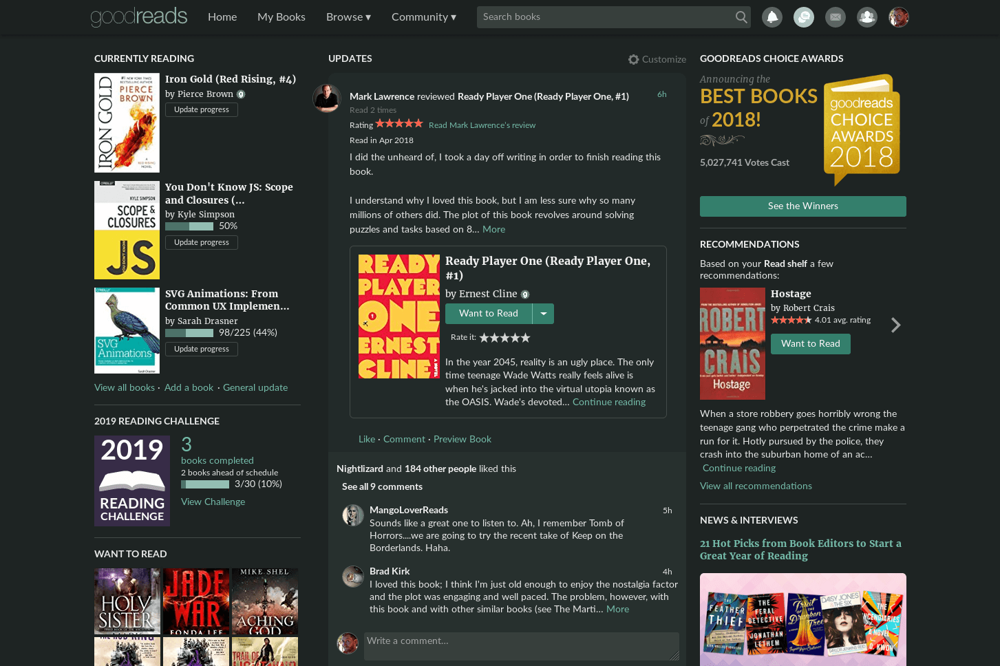
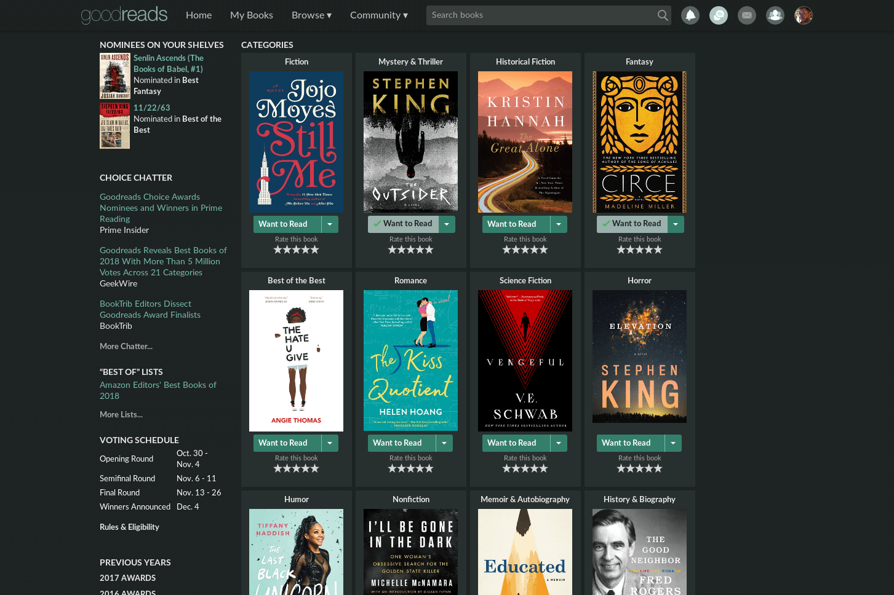
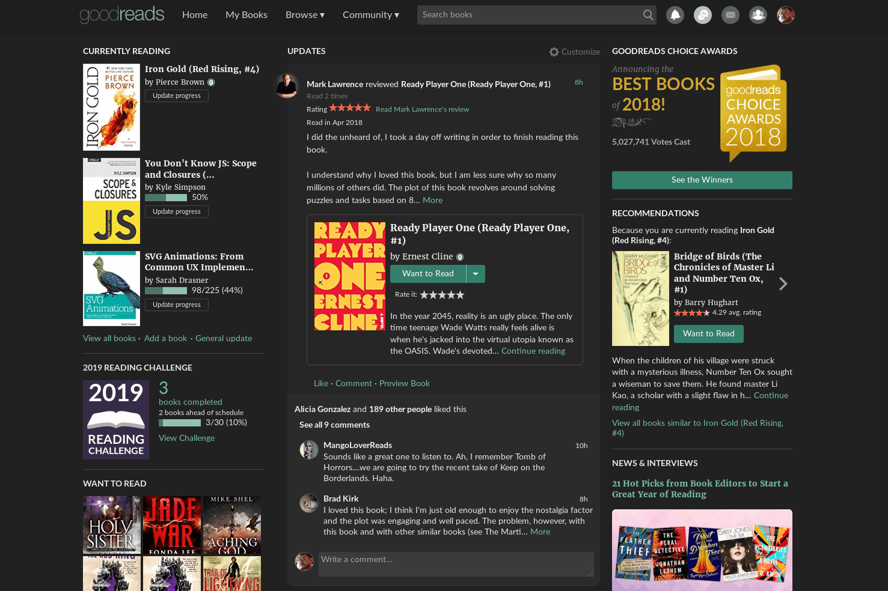
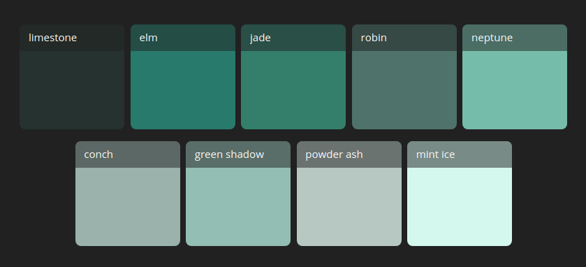
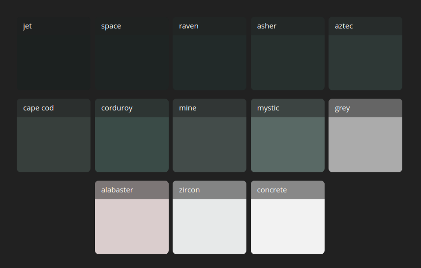

  
    
  

# Goodreads Dark (Jade) theme
This is a dark theme for the [goodreads.com](https://www.goodreads.com) website. This custom userstyle follows [UserCSS](https://github.com/openstyles/stylus/wiki/UserCSS) guidelines.

**Too green?**
Try the [-Zero saturation version](#dark-jade-zero-saturation). It keeps the accent colors the same but zeros out the saturation on the backgrounds making it more grey.

## Table of Contents

1. [Preview](#preview)
2. [How to use](#how-to-use)
3. [Contributing](#contributing)
4. [Color Palette](#color-palette)
5. [Notes](#notes)

## Preview
### Dark Jade

### Dark Jade Zero Saturation

**[Back to top](#table-of-contents)**

## How to use

A userstyle extension for your browser is required, here are a few to choose from:

- [Stylus](https://github.com/openstyles/stylus) for [Firefox](https://addons.mozilla.org/en-US/firefox/addon/styl-us/), [Chrome](https://chrome.google.com/webstore/detail/stylus/clngdbkpkpeebahjckkjfobafhncgmne?hl=en), or [Opera](https://addons.opera.com/en-gb/extensions/details/stylus/).
- xStyle for [Firefox](https://addons.mozilla.org/firefox/addon/xstyle/) or [Chrome](https://chrome.google.com/webstore/detail/xstyle/hncgkmhphmncjohllpoleelnibpmccpj).

Install the Goodreads.com dark theme with the links below. They support automatic updates.

- [Install goodreads.com Dark (Jade) theme](https://github.com/obscuredetour/goodreads-dark/raw/master/goodreads-dark.user.css)
- [Install goodreads.com Dark (Jade) **-Zero saturation** theme](https://github.com/obscuredetour/goodreads-dark/raw/master/goodreads-dark-zerosat.user.css)
  <!--  -->
Or visit the [Goodreads dark (jade) theme](https://userstyles.org/styles/166991/goodreads-dark-jade-theme) at Userstyles.org and click **Install Style**

Copy and pasting the [goodreads-dark.user.css](https://github.com/obscuredetour/goodreads-dark/raw/master/goodreads-dark.user.css) or [goodreads-dark-zerosat.user.css](https://github.com/obscuredetour/goodreads-dark/raw/master/goodreads-dark-zerosat.user.css) file into the Stylus extension also works.

**[Back to top](#table-of-contents)**

## Contributing

Open an issue first to discuss potential changes/additions.

**[Back to top](#table-of-contents)**

## Color palette
### Accent colors (jade)

*Image created in [Color Deck](https://color.obscuredetour.com)*
### Background & text colors

*Image created in [Color Deck](https://color.obscuredetour.com)*

**[Back to top](#table-of-contents)**

## Notes
Why is it so green?
The color scheme was inspired by Jade City. Here's why,
1. Goodreads.com default link color is `hsl(176, 100%, 19%)`

2. I read [Jade City by Fonda Lee](https://www.goodreads.com/book/show/34606064-jade-city) right before creating this.
3. What can I say? I had jade on my mind.

### Bigger project than anticipated
This turned out to be a **HUGE** undertaking. It definitely was the hardest I have tackled thus far. Holy mackrel, why is goodreads so against reusing styles?

I also took liberties with the some aesthetics.
- The removal of many borders.
- Increased some padding here and there.
- Rounded out some corners.

**[Back to top](#table-of-contents)**

## Archived Screenshots
[v1.1 - Goodreads - Explore](https://raw.githubusercontent.com/obscuredetour/goodreads-dark/master/images/ss_v1.1-gr-explore.png)
[v1.1 - Goodreads - News & Interviews](https://raw.githubusercontent.com/obscuredetour/goodreads-dark/master/images/ss_v1.1-gr-news.png)
[v1.1 - Goodreads - 2018 Choice Awards](https://raw.githubusercontent.com/obscuredetour/goodreads-dark/master/images/ss_v1.1-gr-2018-choice.png)

**[Back to top](#table-of-contents)**